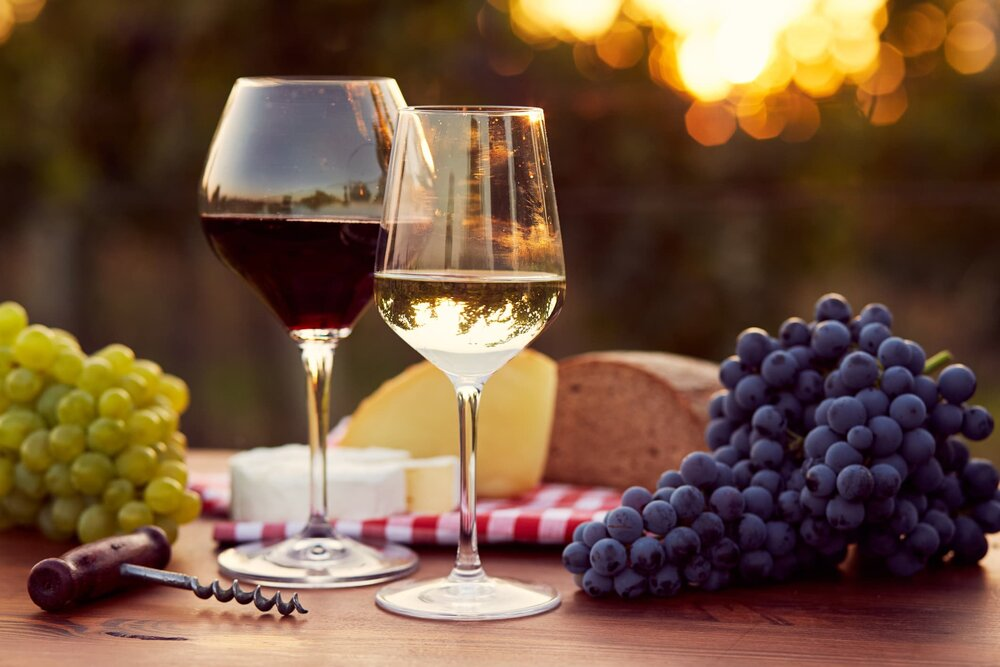

# Amazing Wine Recommender

## Process
1. Scraping websites and storing relevant data into different datasets.
2. Data cleaning :
      - Handling duplicates and NaNs
  - Dealing with redundant information
  - Deciding dropping columns and/or rows
3. Using SQL, import the cleaned data to get 2 final datasets:
  - One for checking wine varieties
  - Another to model
4. Using the "data_to_model" dataset:
  - Prepare data to build a model
  - Using the wine characteristics, check how many clusters would we create
  - Create clusters and asign them into the dataset "clustered_df"
5. First approach to the recommenders:
  - Case folding, tokenizing...
  - Working on some ideas.
6. Next step was working on Streamlit:
  - Creating welcome page
  - Choosing which recommenders apply
  - Creating .py documents for each recommender

<a href='https://docs.google.com/presentation/d/1szWAnBU2Dx_SZjez1shR8Ni8T8SNCh4ZIbWwTsZi7IA/edit?usp=sharing'>Final Project Presentation</a>
